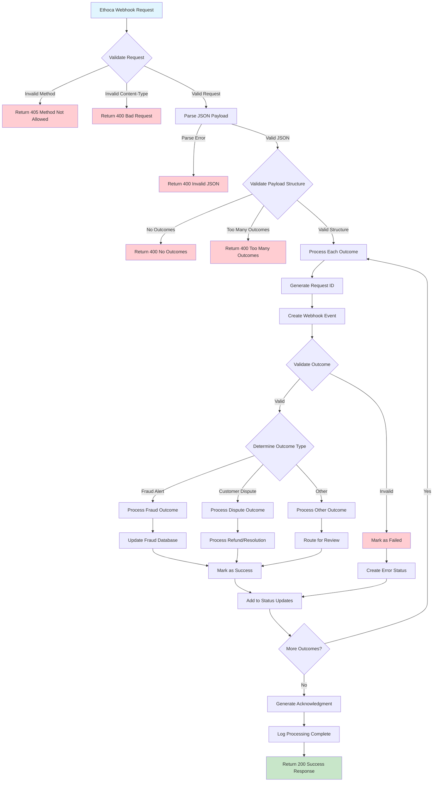

# Webhook Processing Flow Diagram

This diagram shows the complete flow of how Ethoca webhook requests are processed through the system.

## Key Decision Points

1. **Request Validation**: HTTP method and content-type validation
2. **Payload Structure**: JSON parsing and basic structure validation
3. **Business Rules**: Outcome-specific validation and processing
4. **Error Handling**: Comprehensive error tracking and status updates
5. **Response Generation**: Acknowledgment with processing results

## Error Scenarios

- **405 Method Not Allowed**: Non-POST requests
- **400 Bad Request**: Invalid content-type or JSON
- **400 Validation Errors**: Business rule violations
- **500 Internal Server Error**: Processing failures
