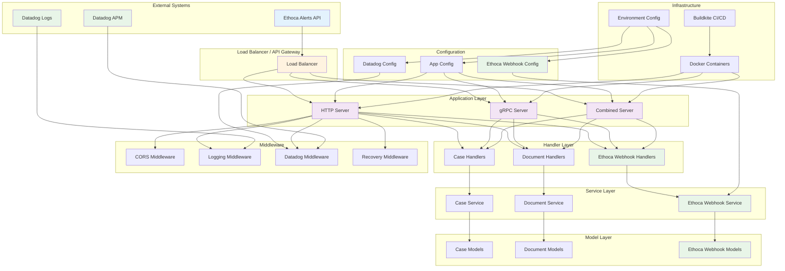

# System Architecture Diagram

This diagram shows the overall system architecture including all components, layers, and their relationships.

## Architecture Layers

### **External Systems**
- **Ethoca Alerts API**: Source of webhook events
- **Datadog APM**: Application performance monitoring
- **Datadog Logs**: Centralized logging service

### **Load Balancer**
- Routes traffic to appropriate servers
- Handles SSL termination
- Provides health checks

### **Application Layer**
- **HTTP Server**: RESTful API endpoints
- **gRPC Server**: High-performance RPC calls
- **Combined Server**: Both HTTP and gRPC in single process

### **Handler Layer**
- **Case Handlers**: Case management operations
- **Document Handlers**: Document processing
- **Ethoca Webhook Handlers**: Webhook event processing

### **Service Layer**
- **Case Service**: Business logic for cases
- **Document Service**: Document processing logic
- **Ethoca Webhook Service**: Webhook processing logic

### **Model Layer**
- Data structures and validation rules
- JSON tags for serialization
- Validation tags for input validation

### **Configuration**
- Environment-specific settings
- Feature flags and toggles
- Service endpoints and credentials

### **Middleware**
- **CORS**: Cross-origin resource sharing
- **Logging**: Request/response logging
- **Datadog**: Tracing and metrics
- **Recovery**: Panic recovery

### **Infrastructure**
- **Docker**: Containerization
- **Buildkite**: CI/CD pipeline
- **Environment Config**: Deployment configuration
