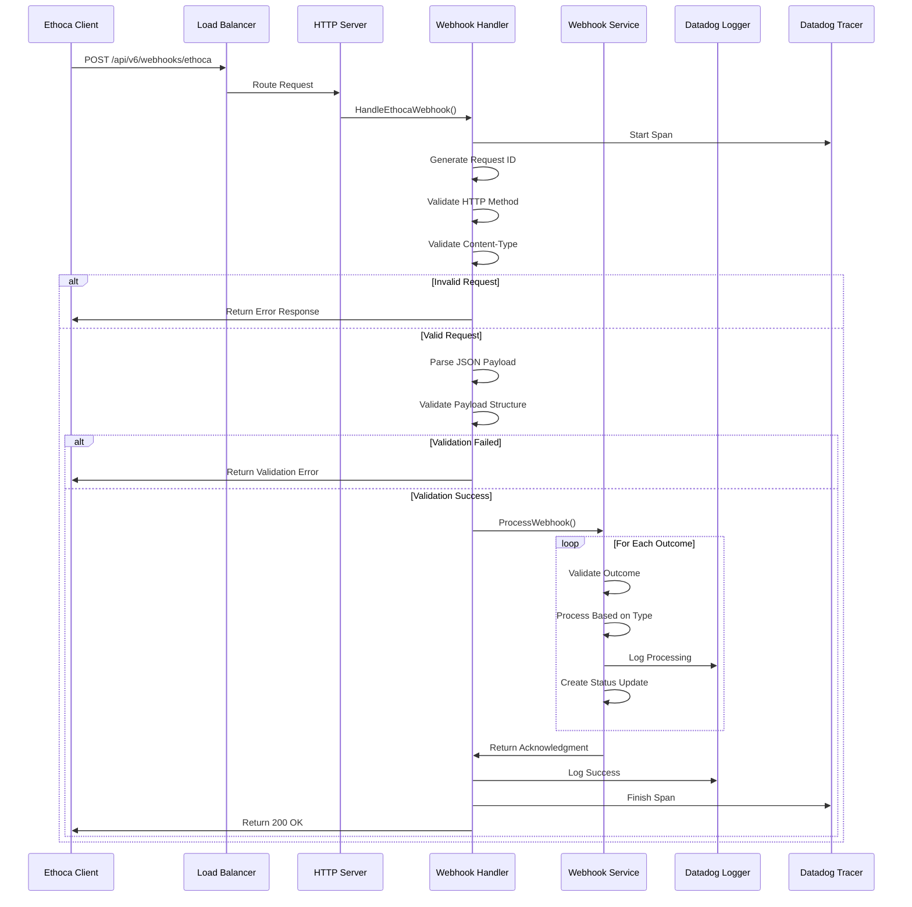

# Data Flow Sequence Diagram

This diagram shows the detailed sequence of interactions between components during webhook processing.

## Sequence Flow Explanation

### **1. Request Initiation**
- Client sends POST request to webhook endpoint
- Load balancer routes to appropriate server instance
- Server delegates to webhook handler

### **2. Request Validation**
- Handler starts Datadog tracing span
- Generates unique request ID for tracking
- Validates HTTP method (must be POST)
- Validates content-type (must be application/json)

### **3. Payload Processing**
- Parses JSON payload into structured data
- Validates payload structure and business rules
- Returns appropriate error responses for invalid data

### **4. Business Logic Processing**
- Delegates processing to webhook service
- Service iterates through each outcome
- Applies business-specific validation rules
- Processes based on outcome type (fraud, dispute, other)

### **5. Response Generation**
- Service returns processing acknowledgment
- Handler logs success/failure information
- Tracer finishes span for observability
- Returns HTTP 200 with processing results

## Key Interactions

- **Handler ↔ Service**: Business logic delegation
- **Service ↔ Logger**: Processing status logging
- **Handler ↔ Tracer**: Distributed tracing
- **All ↔ Client**: HTTP response generation

## Error Handling

- **Invalid Requests**: Immediate error responses
- **Validation Failures**: Detailed error messages
- **Processing Errors**: Graceful degradation with status updates
- **System Failures**: Proper error logging and tracing
