# Project Structure Diagram

This diagram shows the complete project directory structure and organization.

```mermaid
graph TD
    subgraph "Project Root"
        A[cb-mc-service/]
    end
    
    subgraph "Command Entry Points"
        B[cmd/http/main.go]
        C[cmd/grpc/main.go]
        D[cmd/http-grpc/main.go]
    end
    
    subgraph "Internal Application Logic"
        E[internal/config/]
        F[internal/handlers/]
        G[internal/models/]
        H[internal/services/]
    end
    
    subgraph "Public Packages"
        I[pkg/logger/]
        J[pkg/middleware/]
        K[pkg/utils/]
    end
    
    subgraph "Configuration & Build"
        L[.buildkite/]
        M[Dockerfile]
        N[docker-compose.yml]
        O[Makefile]
        P[go.mod]
    end
    
    subgraph "Documentation & Specs"
        Q[docs/]
        R[specs/grpc/]
        S[ethoca-alerts-merchant-api-swagger.yaml]
    end
    
    subgraph "Configuration Files"
        T[.env]
        U[.env.example]
        V[.gitignore]
        W[.policy.yml]
    end
    
    A --> B
    A --> C
    A --> D
    A --> E
    A --> F
    A --> G
    A --> H
    A --> I
    A --> J
    A --> K
    A --> L
    A --> M
    A --> N
    A --> O
    A --> P
    A --> Q
    A --> R
    A --> S
    A --> T
    A --> U
    A --> V
    A --> W
    
    B --> F
    C --> F
    D --> F
    F --> H
    H --> G
    H --> I
    F --> J
    E --> H
    E --> F
    
    style A fill:#e8f5e8
    style B fill:#e3f2fd
    style C fill:#e3f2fd
    style D fill:#e3f2fd
    style E fill:#fff3e0
    style F fill:#f3e5f5
    style G fill:#e8f5e8
    style H fill:#e8f5e8
    style I fill:#fff3e0
    style J fill:#fff3e0
    style K fill:#fff3e0
```

## Directory Structure Explanation

### **Command Entry Points (`cmd/`)**
- **`cmd/http/main.go`**: HTTP-only server entry point
- **`cmd/grpc/main.go`**: gRPC-only server entry point
- **`cmd/http-grpc/main.go`**: Combined HTTP and gRPC server

### **Internal Application Logic (`internal/`)**
- **`internal/config/`**: Configuration management
  - `config.go`: Main application configuration
  - `datadog.go`: Datadog-specific configuration
  - `ethoca.go`: Ethoca webhook configuration
- **`internal/handlers/`**: HTTP request handlers
  - `case_handlers.go`: Case management endpoints
  - `document_handlers.go`: Document processing endpoints
  - `ethoca_webhook_handlers.go`: Webhook processing endpoints
- **`internal/models/`**: Data structures
  - `case.go`: Case-related models
  - `document.go`: Document-related models
  - `ethoca_webhook.go`: Webhook data models
- **`internal/services/`**: Business logic
  - `case_service.go`: Case processing logic
  - `document_service.go`: Document processing logic
  - `ethoca_webhook_service.go`: Webhook processing logic

### **Public Packages (`pkg/`)**
- **`pkg/logger/`**: Logging utilities
  - `datadog.go`: Datadog logger implementation
- **`pkg/middleware/`**: HTTP middleware
  - `cors.go`: CORS handling
  - `datadog.go`: Datadog integration
  - `logger.go`: Request logging
- **`pkg/utils/`**: Utility functions

### **Configuration & Build**
- **`.buildkite/`**: CI/CD pipeline configuration
- **`Dockerfile`**: Multi-stage Docker build
- **`docker-compose.yml`**: Local development environment
- **`Makefile`**: Build and development commands
- **`go.mod`**: Go module dependencies

### **Documentation & Specs**
- **`docs/`**: Project documentation
  - `ETHOCA_WEBHOOK.md`: Webhook integration guide
  - `sample-webhook-payload.json`: Example webhook data
  - `system-diagrams/`: System architecture diagrams
- **`specs/grpc/`**: gRPC service definitions
- **`ethoca-alerts-merchant-api-swagger.yaml`**: API specification

### **Configuration Files**
- **`.env`**: Local environment variables
- **`.env.example`**: Environment template
- **`.gitignore`**: Git ignore patterns
- **`.policy.yml`**: Repository policies

## Key Relationships

- **Entry Points → Handlers**: Route requests to appropriate handlers
- **Handlers → Services**: Delegate business logic to services
- **Services → Models**: Use data models for processing
- **Services → Logger**: Log processing activities
- **Handlers → Middleware**: Apply cross-cutting concerns
- **Config → All**: Provide configuration to all components
