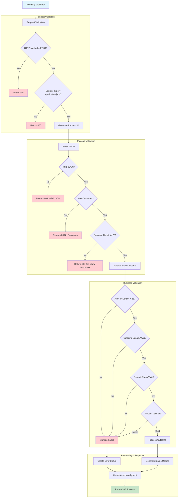

# Security & Validation Flow Diagram

This diagram shows the comprehensive security and validation flow for incoming webhook requests.

## Validation Layers

### **1. Request Validation**
- **HTTP Method**: Only POST requests allowed
- **Content-Type**: Must be `application/json`
- **Request ID**: Unique identifier for tracking

### **2. Payload Validation**
- **JSON Syntax**: Valid JSON structure required
- **Outcome Presence**: Must contain at least one outcome
- **Outcome Count**: Maximum 25 outcomes per request

### **3. Business Validation**
- **Alert ID**: Must be exactly 25 characters
- **Outcome**: Must be 5-30 characters
- **Refund Status**: Must be 8-12 characters
- **Amount Validation**: Currency and value validation

## Security Measures

### **Input Sanitization**
- JSON payload parsing with error handling
- String length validation to prevent buffer overflow
- Content-type validation to prevent MIME confusion

### **Rate Limiting**
- Maximum 25 outcomes per request
- Request size limits enforced
- Processing timeouts implemented

### **Error Handling**
- Detailed error messages for debugging
- Proper HTTP status codes
- Error logging for security monitoring

### **Request Tracking**
- Unique request ID generation
- Comprehensive logging and tracing
- Audit trail for compliance

## Response Codes

- **200 OK**: Successful processing
- **400 Bad Request**: Validation failures
- **405 Method Not Allowed**: Invalid HTTP method
- **500 Internal Server Error**: Processing failures

## Validation Rules

### **Alert ID**
- Required field
- Exact length: 25 characters
- Alphanumeric validation

### **Outcome**
- Required field
- Length: 5-30 characters
- Predefined values validation

### **Refund Status**
- Required field
- Length: 8-12 characters
- Status enum validation

### **Amount Fields**
- Required numeric values
- Currency code validation
- Decimal precision handling
