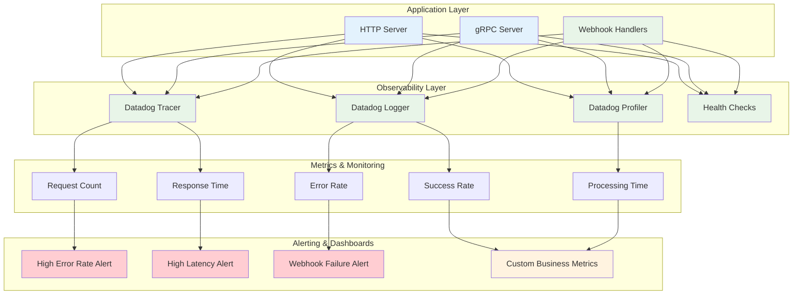

# Monitoring & Observability Diagram

This diagram shows how monitoring, logging, and observability are implemented across the system.



## Observability Components

### **Application Layer**
- **HTTP Server**: RESTful API endpoints with monitoring
- **gRPC Server**: High-performance RPC with tracing
- **Webhook Handlers**: Specialized monitoring for webhook processing

### **Observability Layer**
- **Datadog Tracer**: Distributed tracing across services
- **Datadog Logger**: Structured logging with correlation IDs
- **Datadog Profiler**: Performance profiling and optimization
- **Health Checks**: Service health monitoring endpoints

### **Metrics & Monitoring**
- **Request Count**: Total requests per endpoint
- **Response Time**: P50, P95, P99 latency metrics
- **Error Rate**: Percentage of failed requests
- **Success Rate**: Percentage of successful requests
- **Processing Time**: Time spent in business logic

### **Alerting & Dashboards**
- **High Error Rate Alert**: When error rate exceeds threshold
- **High Latency Alert**: When response time is too slow
- **Webhook Failure Alert**: When webhook processing fails
- **Custom Business Metrics**: Business-specific KPIs

## Monitoring Implementation

### **Distributed Tracing**
```go
// Start span for webhook processing
span := tracer.StartSpan("ethoca.webhook.process", tracer.ResourceName("EthocaWebhook"))
defer span.Finish()

// Add custom tags
span.SetTag("alert_id", outcome.AlertID)
span.SetTag("outcome_type", outcome.Outcome)
span.SetTag("refund_status", outcome.RefundStatus)
```

### **Structured Logging**
```go
// Log with correlation ID and structured fields
logger.InfoWithSpan(span, "Processing webhook outcome", logrus.Fields{
    "request_id": requestID,
    "alert_id":   outcome.AlertID,
    "outcome":    outcome.Outcome,
    "amount":     outcome.AmountStopped.Value,
    "currency":   outcome.AmountStopped.CurrencyCode,
})
```

### **Health Checks**
```go
// Health check endpoint
func GetWebhookHealth(c *gin.Context) {
    config := webhookService.GetWebhookConfig()
    c.JSON(http.StatusOK, gin.H{
        "status":     "healthy",
        "service":    "ethoca-webhook",
        "endpoint":   config.Endpoint,
        "timeout":    config.Timeout,
        "maxRetries": config.MaxRetries,
        "batchSize":  config.BatchSize,
        "timestamp":  time.Now().UTC(),
    })
}
```

## Key Metrics

### **Performance Metrics**
- **Request Duration**: End-to-end request processing time
- **Throughput**: Requests per second
- **Concurrency**: Number of concurrent requests
- **Queue Depth**: Pending request queue length

### **Business Metrics**
- **Webhook Success Rate**: Percentage of successful webhook processing
- **Processing Latency**: Time from receipt to acknowledgment
- **Error Distribution**: Types and frequency of errors
- **Outcome Processing**: Success/failure rates by outcome type

### **Infrastructure Metrics**
- **CPU Usage**: Server resource utilization
- **Memory Usage**: Memory consumption patterns
- **Network I/O**: Network traffic and latency
- **Disk I/O**: Storage performance metrics

## Alerting Rules

### **Critical Alerts**
- Error rate > 5% for 5 minutes
- Response time > 2 seconds for 5 minutes
- Service health check failures
- High memory usage (>90%)

### **Warning Alerts**
- Error rate > 2% for 5 minutes
- Response time > 1 second for 5 minutes
- High CPU usage (>80%)
- Slow webhook processing (>30 seconds)

### **Info Alerts**
- New webhook endpoint registrations
- Configuration changes
- Service deployments
- Performance optimizations

## Dashboard Views

### **Overview Dashboard**
- System health status
- Key performance indicators
- Recent alerts and incidents
- Service dependencies

### **Webhook Dashboard**
- Webhook processing metrics
- Success/failure rates
- Processing time trends
- Error distribution

### **Infrastructure Dashboard**
- Resource utilization
- Network performance
- Storage metrics
- Container health

### **Business Dashboard**
- Transaction volumes
- Processing success rates
- Business KPIs
- Compliance metrics
