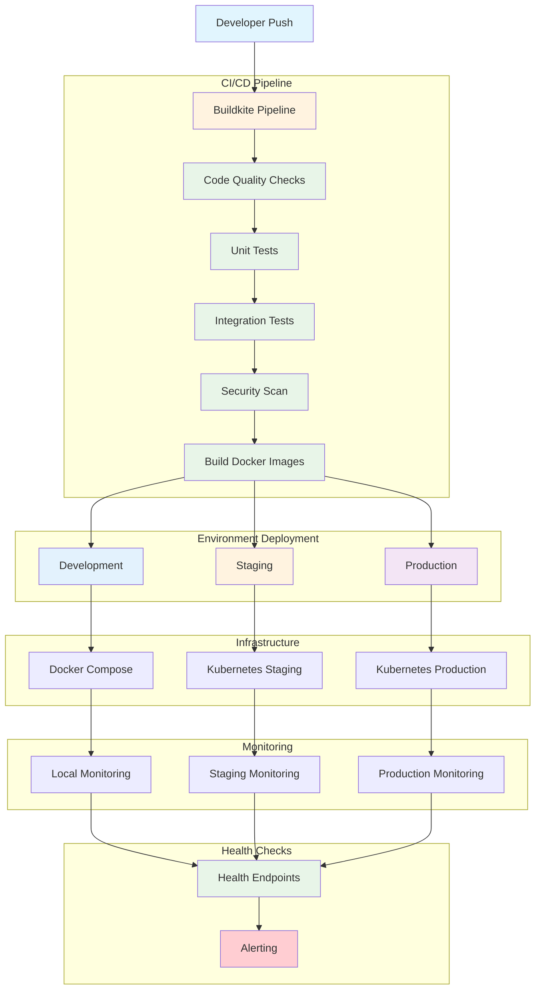

# Deployment & CI/CD Flow Diagram

This diagram shows the complete deployment pipeline and CI/CD workflow for the project.



## CI/CD Pipeline Stages

### **1. Code Quality Checks**
- **Linting**: Go code style validation
- **Formatting**: Code formatting checks
- **Static Analysis**: Security and quality analysis
- **Dependency Scanning**: Vulnerability assessment

### **2. Testing Pipeline**
- **Unit Tests**: Individual component testing
- **Integration Tests**: Service interaction testing
- **Webhook Tests**: Ethoca webhook functionality testing
- **Performance Tests**: Load and stress testing

### **3. Security & Compliance**
- **Security Scan**: Vulnerability scanning
- **License Check**: Open source license compliance
- **Policy Validation**: Repository policy enforcement
- **Secret Scanning**: Credential leak detection

### **4. Build & Package**
- **Docker Build**: Multi-stage container builds
- **Image Tagging**: Version and environment tagging
- **Artifact Storage**: Container registry upload
- **Deployment Manifests**: Kubernetes configuration

## Environment Strategy

### **Development Environment**
- **Purpose**: Local development and testing
- **Infrastructure**: Docker Compose
- **Configuration**: Local environment variables
- **Monitoring**: Basic health checks

### **Staging Environment**
- **Purpose**: Integration testing and validation
- **Infrastructure**: Kubernetes cluster
- **Configuration**: Staging environment variables
- **Monitoring**: Full observability stack

### **Production Environment**
- **Purpose**: Live service delivery
- **Infrastructure**: Production Kubernetes cluster
- **Configuration**: Production secrets and configs
- **Monitoring**: Comprehensive monitoring and alerting

## Buildkite Pipeline Configuration

### **Pipeline Structure**
```yaml
# .buildkite/pipeline.yml
steps:
  - label: "Code Quality"
    command: make lint
    
  - label: "Unit Tests"
    command: make test
    
  - label: "Integration Tests"
    command: make test-integration
    
  - label: "Security Scan"
    command: make security-scan
    
  - label: "Build Images"
    command: make docker-build
    
  - label: "Deploy to Staging"
    command: make deploy-staging
    
  - label: "Deploy to Production"
    command: make deploy-production
```

### **Makefile Commands**
```makefile
# Makefile
.PHONY: lint test test-integration security-scan docker-build deploy-staging deploy-production

lint:
	go vet ./...
	golangci-lint run

test:
	go test -v ./...

test-integration:
	go test -v -tags=integration ./tests/

security-scan:
	gosec ./...

docker-build:
	docker build -t mastercom-service:latest .

deploy-staging:
	kubectl apply -f k8s/staging/

deploy-production:
	kubectl apply -f k8s/production/
```

## Docker Build Process

### **Multi-Stage Build**
```dockerfile
# Dockerfile
FROM golang:1.25-alpine AS base
WORKDIR /app
COPY go.mod go.sum ./
RUN go mod download

FROM base AS test
COPY . .
RUN go test -v ./...

FROM base AS build
COPY . .
RUN CGO_ENABLED=0 GOOS=linux go build -o server ./cmd/http

FROM alpine:latest AS release
RUN apk --no-cache add ca-certificates
WORKDIR /root/
COPY --from=build /app/server .
CMD ["./server"]
```

### **Build Variants**
- **Base**: Common dependencies and setup
- **Test**: Testing environment with all source code
- **Build**: Compilation and binary generation
- **Release**: Minimal production image

## Kubernetes Deployment

### **Staging Configuration**
```yaml
# k8s/staging/deployment.yaml
apiVersion: apps/v1
kind: Deployment
metadata:
  name: mastercom-service-staging
spec:
  replicas: 2
  selector:
    matchLabels:
      app: mastercom-service
  template:
    metadata:
      labels:
        app: mastercom-service
        environment: staging
    spec:
      containers:
      - name: mastercom-service
        image: mastercom-service:staging
        ports:
        - containerPort: 8080
        env:
        - name: ENVIRONMENT
          value: "staging"
```

### **Production Configuration**
```yaml
# k8s/production/deployment.yaml
apiVersion: apps/v1
kind: Deployment
metadata:
  name: mastercom-service-production
spec:
  replicas: 5
  selector:
    matchLabels:
      app: mastercom-service
  template:
    metadata:
      labels:
        app: mastercom-service
        environment: production
    spec:
      containers:
      - name: mastercom-service
        image: mastercom-service:production
        ports:
        - containerPort: 8080
        resources:
          requests:
            memory: "256Mi"
            cpu: "250m"
          limits:
            memory: "512Mi"
            cpu: "500m"
```

## Health Checks & Monitoring

### **Health Endpoints**
- **`/__ops/ping`**: Basic health check
- **`/health`**: Detailed service health
- **`/api/v6/webhooks/ethoca/health`**: Webhook-specific health

### **Monitoring Integration**
- **Datadog APM**: Application performance monitoring
- **Datadog Logs**: Centralized logging
- **Datadog Metrics**: Custom business metrics
- **Alerting**: Automated incident response

### **Deployment Validation**
- **Health Check Verification**: Ensure service is responding
- **Smoke Tests**: Basic functionality validation
- **Performance Baseline**: Response time verification
- **Rollback Strategy**: Quick rollback on issues

## Rollback Strategy

### **Automatic Rollback Triggers**
- Health check failures
- High error rates
- Performance degradation
- Security vulnerabilities

### **Manual Rollback Process**
- Identify problematic deployment
- Trigger rollback pipeline
- Verify previous version health
- Update deployment status

### **Rollback Validation**
- Service health verification
- Performance metrics validation
- Business functionality testing
- Monitoring alert resolution
